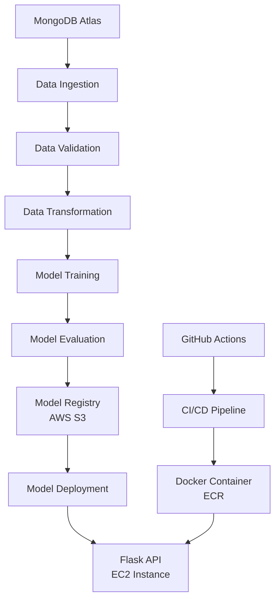

# 🚀 Vehicle Data MLOps Project - End-to-End Machine Learning Pipeline

[](https://www.python.org/)
[](https://ml-ops.org/)
[](https://www.docker.com/)
[](https://aws.amazon.com/)
[](https://www.mongodb.com/)
[](https://github.com/features/actions)

## 📋 Table of Contents
- [✨ Overview](#-overview)
- [🏗️ Architecture](#️-architecture)
- [🛠️ Tech Stack](#️-tech-stack)
- [🚀 Features](#-features)
- [📁 Project Structure](#-project-structure)
- [⚙️ Installation & Setup](#️-installation--setup)
- [🔧 Pipeline Components](#-pipeline-components)
- [🌐 Deployment](#-deployment)
- [📊 Monitoring & Logging](#-monitoring--logging)
- [🤝 Contributing](#-contributing)

## ✨ Overview

An enterprise-grade MLOps platform for vehicle data analysis and predictive modeling. This project demonstrates a complete machine learning lifecycle from data ingestion to production deployment, featuring automated CI/CD pipelines, cloud infrastructure, and comprehensive monitoring.

**Key Highlights:**
- 🔄 **End-to-End ML Pipeline**: From raw data to production-ready API
- ☁️ **Cloud-Native Architecture**: Leveraging AWS, MongoDB Atlas, and Docker
- 🤖 **Automated CI/CD**: GitHub Actions for seamless deployment
- 📈 **Production-Ready**: Scalable, maintainable, and monitored

## 🏗️ Architecture



## 🛠️ Tech Stack

### **Backend & ML**
-  Python 3.10
-  Scikit-learn
-  Pandas & NumPy
-  Flask API

### **Database & Storage**
-  MongoDB Atlas
-  AWS S3 Buckets

### **Cloud & DevOps**
-  AWS EC2, ECR, IAM
-  Docker Containerization
-  GitHub Actions CI/CD

### **Monitoring & Quality**
- Custom Logging & Exception Handling
- Data Validation with Schema Management
- Model Performance Tracking

## 🚀 Features

### **🔧 Core ML Pipeline**
- **Automated Data Ingestion**: Real-time data pipeline from MongoDB Atlas
- **Smart Data Validation**: Schema-based validation with configurable rules
- **Feature Engineering**: Automated transformation pipelines
- **Model Versioning**: Track and compare model performance
- **A/B Testing**: Model evaluation with configurable thresholds

### **☁️ Cloud Integration**
- **Secure Credential Management**: Environment-based configuration
- **Scalable Storage**: AWS S3 for model artifact storage
- **Containerized Deployment**: Docker-based consistent environments
- **Auto-scaling Ready**: EC2 instance with configurable specifications

### **🔄 DevOps Excellence**
- **One-Click Deployment**: Automated CI/CD with GitHub Actions
- **Self-hosted Runners**: Dedicated EC2 instances for pipeline execution
- **Blue-Green Deployment**: Safe rollouts with zero downtime
- **Infrastructure as Code**: Reproducible cloud setup

### **📊 Monitoring & Operations**
- **Centralized Logging**: Structured logs for debugging and auditing
- **Performance Metrics**: Track model drift and data quality
- **Health Checks**: Automated system monitoring
- **Alerting System**: Proactive issue detection

## 📁 Project Structure

```
vehicle-mlops/
│
├── src/                          # Source code
│   ├── components/               # Pipeline components
│   │   ├── data_ingestion.py
│   │   ├── data_validation.py
│   │   ├── data_transformation.py
│   │   ├── model_trainer.py
│   │   ├── model_evaluation.py
│   │   └── model_pusher.py
│   │
│   ├── configuration/            # Configuration management
│   │   ├── mongo_db_connection.py
│   │   └── aws_connection.py
│   │
│   ├── entity/                   # Data entities and schemas
│   │   ├── config_entity.py
│   │   ├── artifact_entity.py
│   │   └── estimator.py
│   │
│   ├── aws_storage/              # AWS S3 operations
│   ├── constants/                # Project constants
│   ├── data_access/              # Data layer
│   ├── exception/                # Custom exceptions
│   ├── logger/                   # Logging configuration
│   └── utils/                    # Utility functions
│
├── notebooks/                    # Jupyter notebooks
│   ├── EDA.ipynb                 # Exploratory Data Analysis
│   ├── feature_engineering.ipynb
│   └── mongoDB_demo.ipynb       # MongoDB operations demo
│
├── templates/                    # Flask templates
├── static/                       # Static assets
├── artifact/                     # Pipeline artifacts
├── tests/                        # Test suite
│
├── requirements.txt              # Dependencies
├── config/                       # Configuration files
│   └── schema.yaml              # Data validation schema
│
├── Dockerfile                    # Docker configuration
├── .dockerignore
├── .github/workflows/           # CI/CD pipelines
│   └── aws.yaml
├── app.py                       # Flask application
└── setup.py                     # Package setup
```

## ⚙️ Installation & Setup

### **Prerequisites**
```bash
# System Requirements
- Python 3.10
- Conda/Miniconda
- Docker (for containerization)
- AWS Account (for deployment)
- MongoDB Atlas Account
```

### **Quick Start**

1. **Clone and Setup Environment**
```bash
# Create project from template
python template.py

# Create virtual environment
conda create -n vehicle python=3.10 -y
conda activate vehicle

# Install dependencies
pip install -r requirements.txt

# Verify installation
pip list
```

2. **Database Setup (MongoDB Atlas)**
```bash
# Set MongoDB connection string
export MONGODB_URL="mongodb+srv://<username>:<password>@cluster.mongodb.net/"
```

3. **AWS Configuration**
```bash
# Set AWS credentials
export AWS_ACCESS_KEY_ID="your_access_key"
export AWS_SECRET_ACCESS_KEY="your_secret_key"
export AWS_DEFAULT_REGION="us-east-1"
```

## 🔧 Pipeline Components

### **1. Data Ingestion**
- Connects to MongoDB Atlas
- Fetches vehicle data in key-value format
- Transforms to pandas DataFrame
- Stores raw data artifacts

### **2. Data Validation**
- Schema validation using YAML configuration
- Data type and range checking
- Missing value detection
- Data quality reports

### **3. Data Transformation**
- Feature engineering pipelines
- Encoding categorical variables
- Scaling numerical features
- Train-test split management

### **4. Model Training**
- Multiple algorithm support
- Hyperparameter tuning
- Cross-validation
- Model persistence

### **5. Model Evaluation**
- Performance metrics calculation
- Threshold-based model comparison
- AWS S3 integration for model registry
- Drift detection

### **6. Model Deployment**
- Flask REST API
- Docker containerization
- AWS EC2 deployment
- Load balancing ready

## 🌐 Deployment

### **CI/CD Pipeline**
```yaml
# GitHub Actions Workflow (.github/workflows/aws.yaml)
- Trigger: On push to main branch
- Steps:
  1. Code checkout
  2. Run tests
  3. Build Docker image
  4. Push to AWS ECR
  5. Deploy to EC2
  6. Health check
```

### **AWS Infrastructure**
- **EC2**: T2 Medium instance (Ubuntu 24.04)
- **S3**: Model artifact storage (`my-model-mlopsproj`)
- **ECR**: Docker image registry
- **IAM**: Secure access management

### **Deployment Commands**
```bash
# Manual deployment
docker build -t vehicle-mlops .
docker run -p 5000:5000 vehicle-mlops

# Access application
http://<ec2-public-ip>:5000
```

## 📊 Monitoring & Logging

### **Logging Features**
- Structured JSON logging
- Multi-level logging (DEBUG, INFO, ERROR)
- File and console handlers
- Rotating log files

### **Performance Tracking**
- Model accuracy metrics
- Inference latency
- Resource utilization
- Error rates

## 🤝 Contributing

1. Fork the repository
2. Create a feature branch
3. Commit your changes
4. Push to the branch
5. Open a Pull Request

---

## 📞 Contact & Support

For questions:
- 📧 Email: abhijeetsml4@gmail.com
- 💼 LinkedIn: [linkedin.com/in/abhijeet-samal](https://www.linkedin.com/in/abhijeet-samal/)

---

**⭐ Star this repo if you find it useful!**

---
*This project demonstrates professional MLOps practices suitable for production environments. Built with scalability, maintainability, and best practices in mind.*

---